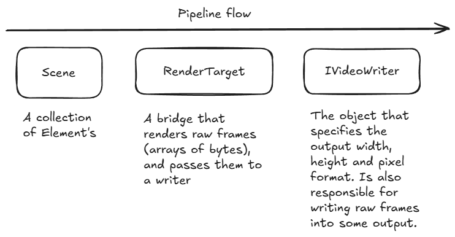
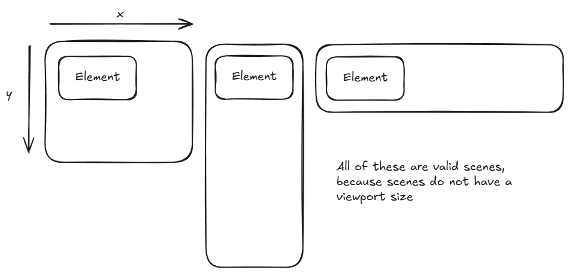
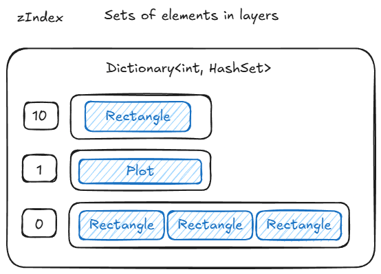
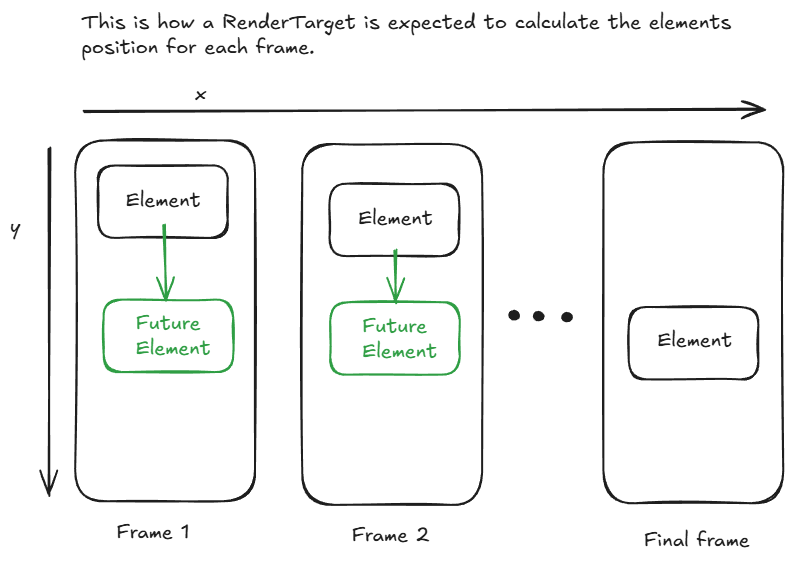
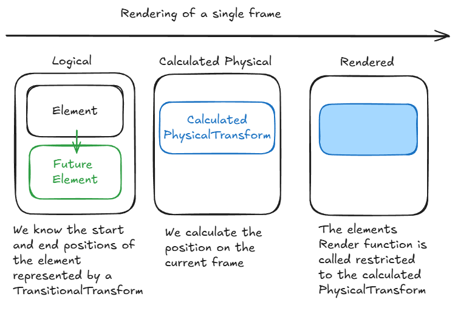
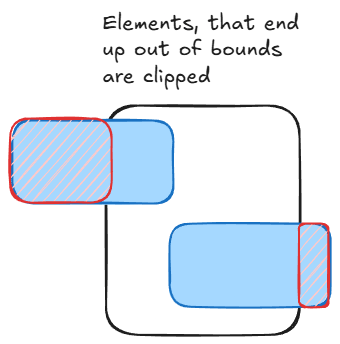
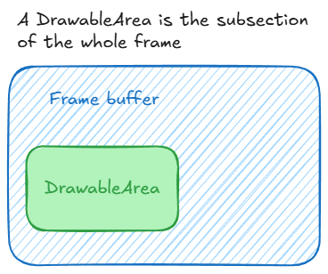
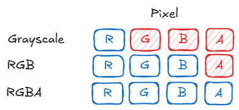
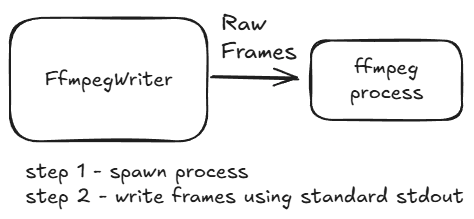

# Architecture

1. [Rendering PIPELINE](#rendering-pipeline)
    1. [Scene](#scene)
    2. [RenderTarget](#rendertarget)
    3. [DrawableArea](#drawablearea)
    4. [IVideoWriter](#ivideowriter)
        1. [PixelFormat Enum](#pixelformat-enum)
        2. [IVideoWriter Interface](#ivideowriter-interface)
        3. [The ffmpeg implementation](#the-ffmpeg-implementation)
2. [Publishing](#publishing)

## Rendering PIPELINE

### Scene

| Member / Method | Type | Description |
|-----------------|------|-------------|
| `Scene(RenderTarget renderTarget)` | Constructor | Initializes a new Scene with the specified `RenderTarget`. |
| `Add<T>(T element)` | `T` | Adds an existing element instance to the scene. Returns the added element. `<T>` must be of type `Element`. Automatically tracks changes to `zIndex` and moves elements between layers accordingly. |
| `Go(int seconds)` | `void` | Advances the scene by generating frames for all elements over the given duration (in seconds). Applies each element's next state after rendering. |

If we add an `Element` to a scene `Scene`, it is now registered its animations will be taken into account.  
It is important to realize that scenes **do not have a size**, they are simple collections of elements.

Internally elements are stored in an `OrderedDictionary` that has sets of elements for each given layer.

### RenderTarget

| Member / Method | Type | Description |
|-----------------|------|-------------|
| `RenderStateReporter` | `IRenderStateReporter?` | Optional property to report rendering state, progress, and frame events. |
| `AddElementFrames(IReadOnlyList<Element> elements, int seconds)` | `abstract void` | Abstract method that generates frames for the provided elements over a given duration in seconds. Each element may have "Current" and "Next" states that should be interpolated or applied over the time span. |

> `RenderTarget` is an abstract base class. Concrete implementations should define how frames are actually produced.  
> `RenderStateReporter` can be used to track rendering progress for sequences (all frames of one animation) and chunks.

And when a `Scene.Go` function is called, the number of frames to render is calculated:

When frames are rendered the elements move using their interpolation functions:

The rendering sequence for an element goes like this:
 

#### DrawableArea

| Member / Method | Type | Description |
|-----------------|------|-------------|
| `Width` | `int` | Width of the subarea in pixels. |
| `Height` | `int` | Height of the subarea in pixels. |
| `Format` | `PixelFormat` | Pixel format of the area (Grayscale, RGB, RGBA). |
| `BytesPerPixel` | `int` | Number of bytes per pixel, derived from `Format`. |
| `DrawableArea(...)` | Constructor | Creates a subrectangle within a full image buffer. Both the subarea offset (`subX`, `subY`) and local coordinates may be negative. Throws if dimensions are invalid or buffer too small. |
| `SetPixel(int x, int y, Pixel pixel)` | `void` | Sets a pixel using local coordinates. Writes only if the resulting position lies within both the subarea and full image. |
| `SetRow(int y, Pixel pixel)` | `void` | Sets an entire row of pixels in the subarea. Local `y` may be negative. |
| `SetColumn(int x, Pixel pixel)` | `void` | Sets an entire column of pixels in the subarea. Local `x` may be negative. |
| `Fill(Pixel pixel)` | `void` | Fills the entire subarea with a single color, respecting clipping against both the subarea and full image. |

> The subarea may have negative offsets, and local pixel coordinates may also be negative.  
> All writes are clipped to the subarea and the full image.  

The `DrawableArea` always accepts a whole RGBA pixel as an argument, but depending on mode it behaves like this (Only the blue components are used)

### IVideoWriter

The video writer defines what pixel formats are supported,

#### PixelFormat Enum

| Value | Bytes per Pixel | Description |
|-------|----------------|-------------|
| `Grayscale` | 1 | 8-bit grayscale (1 byte per pixel). |
| `RGB` | 3 | 24-bit RGB (3 bytes per pixel). |
| `RGBA` | 4 | 32-bit RGBA (4 bytes per pixel, includes alpha channel). |

#### IVideoWriter Interface

| Member / Method | Type | Description |
|-----------------|------|-------------|
| `PixelFormat` | `PixelFormat` | The pixel format of the video frames (Grayscale, RGB, or RGBA). |
| `FPS` | `int` | Frames per second of the output video. |
| `Width` | `int` | Width of the video in pixels. |
| `Height` | `int` | Height of the video in pixels. |
| `FrameSizeInBytes` | `int` | Size of a single frame in bytes (Width × Height × BytesPerPixel). |
| `Write(byte[] frameData, int frameCount)` | `void` | Writes one or more raw frames to the video output. `frameData` contains the frame bytes; `frameCount` specifies the number of frames in the array. |
| `Flush()` | `void` | Flushes any buffered frame data to the output, ensuring all frames are written. |

> `IVideoWriter` implementations are responsible for converting raw frame data into a video format.  
> `FrameSizeInBytes` can be used to allocate frame buffers correctly.  
> Always call `Flush()` after writing frames to ensure the video is finalized properly.

#### The ffmpeg implementation

There is one builtin implementation of a video writer, thats the `FfmpegWriter`,  
it uses an ffmpeg cli executable, opens it as a process and streams raw frames into it.

| Member / Method | Type | Description |
|-----------------|------|-------------|
| `PixelFormat` | `PixelFormat` | Pixel format of the video frames (Grayscale, RGB, RGBA). |
| `FPS` | `int` | Frames per second of the output video. |
| `Width` | `int` | Width of the video in pixels. |
| `Height` | `int` | Height of the video in pixels. |
| `FrameSizeInBytes` | `int` | Size of one frame in bytes (`Width × Height × BytesPerPixel`). |
| `FfmpegVideoWriter(int width, int height, int targetFPS, PixelFormat pixelFormat, string outputFilename, string ffmpegPath)` | Constructor | Starts an FFmpeg process and prepares it to receive raw frames. Throws if FFmpeg is not found. |
| `Write(byte[] bytes, int frameCount)` | `void` | Writes a sequence of raw frames to FFmpeg. Throws if the buffer size is insufficient. |
| `Flush()` | `void` | Flushes any buffered frame data to FFmpeg. |
| `FinishVideo()` | `void` | Finalizes the video by closing the FFmpeg input stream and waiting for FFmpeg to exit. Throws if FFmpeg exits with an error. |
| `Dispose()` | `void` | Disposes the writer and ensures the video is finalized. |

> Reads FFmpeg `stderr` asynchronously to prevent pipe blocking.  
> Ensure `FinishVideo()` or `Dispose()` is called after writing frames to properly close the video file.  
> `Write()` expects the frame data to be contiguous and match the `FrameSizeInBytes` × `frameCount`.

## Publishing

Use the `release_builder.py` script
