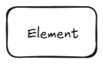
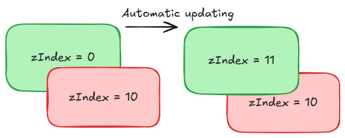
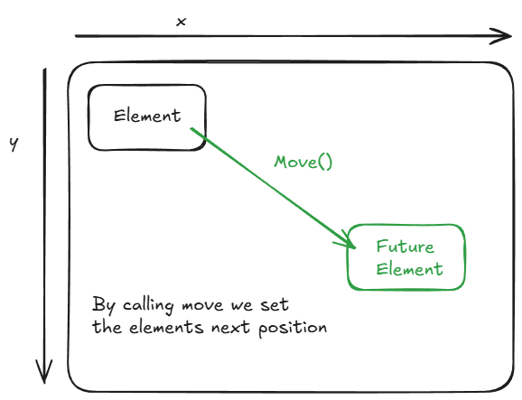
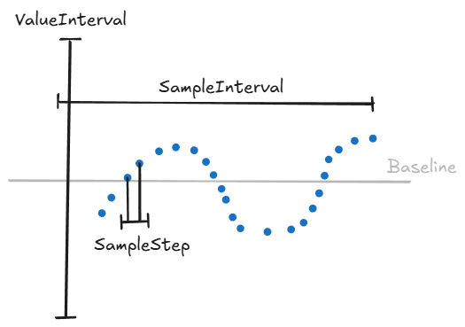

# Elements

1. [Base Element](#base-element)
   - [TransitionalTransform](#transitionaltransform)
2. [Implemented Elements](#implemented-elements)
   - [Rectangle](#rectangle)
   - [Plot2D](#plot2d)

## Base Element

| Member / Method | Type | Description |
|-----------------|------|-------------|
| `AnimationInterpolator` | `IInterpolator` | Gets the interpolator used to calculate intermediate states between `Current` and `Next` values for smooth animations. Defaults to `LinearInterpolator`. |
| `zIndex` | `ObservableProperty<int>` | Determines the element's rendering layer. Elements with higher `zIndex` values are drawn on top of elements with lower values. Changing `zIndex` automatically moves the element between layers in its scene. |
| `Render(ref DrawableArea area, float animationPercentage)` | `abstract void` | Abstract method that renders the element into a `DrawableArea` for a specific animation frame. Derived classes must implement this to define the element's drawing behavior. The `animationPercentage` parameter represents progress of the animation (0.0 = start, 1.0 = end). |

> `Element` is an abstract base class for all renderable objects in a `Scene`.  
> Inherits from `TransitionalTransform` (position/size animation) and implements `ISurface`.  
> Concrete elements must implement `Render` to produce visual output in a `DrawableArea`.  
> The `AnimationInterpolator` can be replaced with custom interpolators to achieve non-linear animation effects.  
> The `zIndex` determines the drawing order: elements with higher values appear above lower ones.

Everything actor in a scene is an element.

Elements in a scene are placed in layers, higher zIndex is placed on top.

Elements can and likely will have a set next positions:


### TransitionalTransform

`TransitionalTransform` is an abstract base class for elements that have a **position and size** with smooth transitions between frames.  
It uses `TransitionalProperty<T>` for each property, storing both **Current** (read-only) and **Next** (modifiable) values, allowing independent interpolation of position and size.

#### Usage

- Modify `X.Next`, `Y.Next`, `Width.Next`, `Height.Next` to set the target state.

#### Properties

| Property | Type | Description |
|----------|------|-------------|
| `X` | `TransitionalProperty<float>` | Horizontal position of the element. |
| `Y` | `TransitionalProperty<float>` | Vertical position of the element. |
| `Width` | `TransitionalProperty<float>` | Width of the element. |
| `Height` | `TransitionalProperty<float>` | Height of the element. |

#### Key Methods

| Method | Description |
|--------|-------------|
| `Move(float x, float y)` | Sets the next position (`X.Next`, `Y.Next`) for the element. |
| `Resize(float width, float height)` | Sets the next size (`Width.Next`, `Height.Next`) for the element. |

### Implemented Elements

## Rectangle

> The background color can be customized at creation or modified later but it does not support color transitions.

| Member / Method | Type | Description |
|-----------------|------|-------------|
| `BackgroundColor` | `Pixel` | The background color of the rectangle. Defaults to green. |
| `Rectangle()` | Constructor | Initializes a 10x10 rectangle with the default green background color. |
| `Rectangle(int width, int height, Pixel? backgroundColor = null)` | Constructor | Initializes a rectangle with the specified width, height, and optional background color. |
| `Render(ref DrawableArea area, float animationPercentage)` | `override void` | Fills the given drawable area with the rectangle's background color. Uses the current animation state (width/height). |

Is a rectangle with a solid background.

Example usage:

``` csharp
// Add two rectangles to the scene
var rect = Add(new Rectangle(100, 100));
rect.BackgroundColor = Pixel.Red;

var rect2 = Add(new Rectangle(50, 100));

// Move rectangles to the right
rect.Move(100, 0);
rect2.Move(100, 0);

// Render animation for 1 second
Go(1);

// Change zIndex of the first rectangle and move both down
rect.zIndex.Value = 1;
rect.Move(100, 200);
rect2.Move(100, 200);
Go(1);

// Bring the second rectangle on top and move both horizontally
rect2.zIndex.Value = 2;
rect.Move(300, 200);
rect2.Move(300, 200);
Go(1);
```

## Plot2D

> Supports interpolated animation of the function, sample intervals, step size, and vertical display range

| Member / Method | Type | Description |
|-----------------|------|-------------|
| `StrokeColor` | `Pixel` | The color used to draw the line representing the sampled function. Defaults to blue. |
| `SampledFunction` | `TransitionalProperty<Func<double, double>>` | The function being plotted. Can be animated between `Current` and `Next` states. |
| `SampleInterval` | `TransitionalProperty<Interval<double>>` | The range of x-values to sample from the function. |
| `ValueInterval` | `TransitionalProperty<Interval<double>>` | The range of y-values for plotting. Used to normalize function output. |
| `SampleStep` | `TransitionalProperty<double>` | Step size for sampling the function along the x-axis. |
| `ValueIntervalInterpolator` | `IInterpolator` | Interpolator used to animate the vertical value range between `Current` and `Next`. |
| `SampleCountInterpolator` | `IInterpolator` | Interpolator used to animate the number of samples between `Current` and `Next`. |
| `SampleInterpolator` | `IInterpolator` | Interpolator used to animate individual sample values between `Current` and `Next`. |
| `Plot2D()` | Constructor | Initializes a 500x500 plotting area with default sampling and value intervals. |

Is a plot element that renders function samples as sets of pixels. Renders continuous lines with small step sizes.



Example usage:

```csharp
// Add a Plot2D element
var plot = Add(new Plot2D());

// Set initial position
plot.X.Next = 300;
plot.Y.Next = 300;
Go(1);

// Animate function sampling range and value interval
plot.SampleInterval.Next = new Interval<double>(-3.14 * 3, 3.14 * 3);
plot.ValueInterval.Next = new Interval<double>(-1.2, 1.2);

// Set function to sin(x)
plot.SampledFunction.Next = (x) => Math.Sin(x);
Go(1);

// Animate to a wider range over 3 seconds
plot.SampleInterval.Next = new Interval<double>(-3.14 * 30, 3.14 * 30);
Go(3);
```
